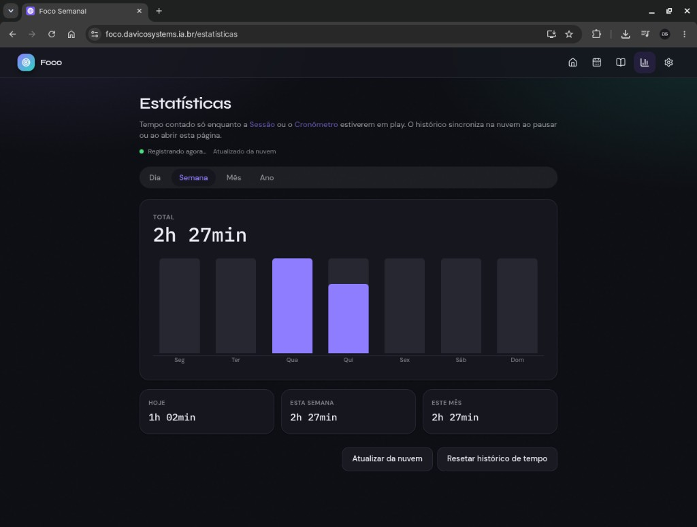
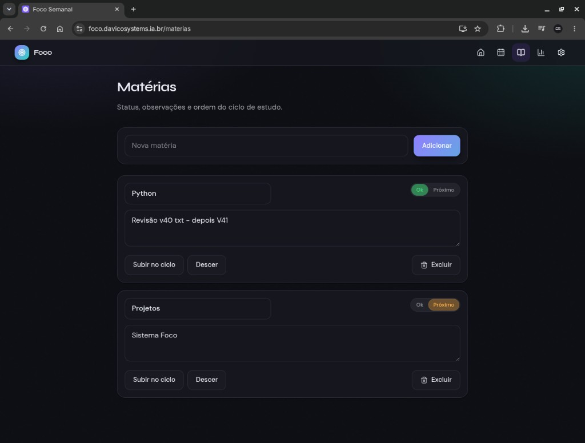
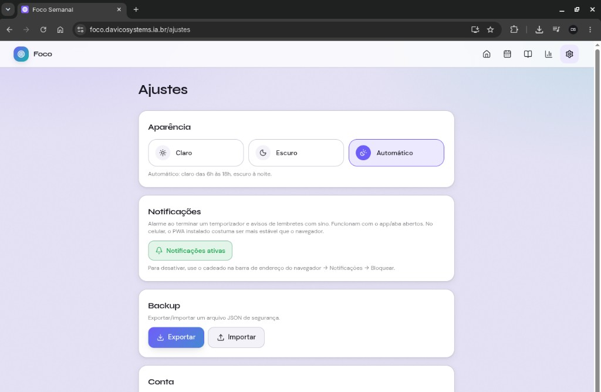
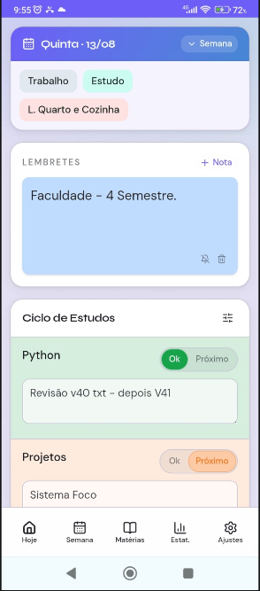

# Foco

App de organização de estudos: grade da semana, ciclo de matérias, timers, lembretes e estatísticas de foco.

**Demo:** [https://foco.davicosystems.ia.br](https://foco.davicosystems.ia.br)  
**Stack:** Next.js · React · TypeScript · Tailwind CSS · Supabase · Vercel

---

## Prévia

### Hoje

Grade da semana, ciclo de matérias, lembretes, timers e foco do dia.


### Estatísticas

Tempo de estudo (Sessão + cronômetro) — dia, semana, mês e ano, com sync na nuvem.



### Matérias

Status Ok / Próximo, anotações e ordem do ciclo.



### Ajustes

Tema, notificações, backup JSON e conta.



### Celular (PWA)

A mesma tela principal no telefone.



---

## O que o sistema faz

| Área | Função |
|------|--------|
| **Hoje** | Visão do dia + semana, ciclo de matérias, lembretes e timers na lateral |
| **Semana** | Grade editável de blocos por dia |
| **Matérias** | Ciclo de estudos com status Ok / Próximo e observações |
| **Estatísticas** | Gráficos de tempo de foco (Sessão + cronômetro em play) |
| **Temporizadores** | Vários timers, cronômetro, volume e 3 toques de alarme |
| **Ajustes** | Tema, notificações do navegador, backup e conta |

**Autenticação:** acesso por convite, e-mail e senha, com recuperação por link. Só e-mails autorizados entram. Os dados principais ficam na **nuvem** (Supabase).
**Backup:** exportar/importar JSON em Ajustes (plano B manual).  
**Nuvem também:** histórico de foco / Estatísticas / Foco hoje (sincroniza ao pausar ou ao abrir Estatísticas).  
**Local no aparelho:** timers/cronômetro em andamento (sobrevivem ao F5), tema e preferências de alarme.

---

## Tecnologias

- **Next.js 16** (App Router) + **React 19** + **TypeScript**
- **Tailwind CSS 4**
- **Supabase** (Auth magic link + Postgres)
- Deploy na **Vercel** com domínio próprio

---

## Como rodar localmente

```bash
npm install
cp .env.example .env.local   # preencha URL e anon key do Supabase
npm run dev
```

Abra [http://localhost:3000](http://localhost:3000).

Setup completo (Supabase + Vercel + redirects): veja **[SETUP.md](SETUP.md)**.

---

## Estrutura (visão rápida)

```
src/app/(app)/     # páginas do app (hoje, semana, matérias, estatísticas, ajustes…)
src/components/    # UI e providers (timers, shell, login…)
src/lib/           # domínio: sync, áudio, focus-log, tipos
supabase/          # schema SQL
docs/screenshots/  # prévias do README
```

---

## Licença

Projeto pessoal / portfólio.
